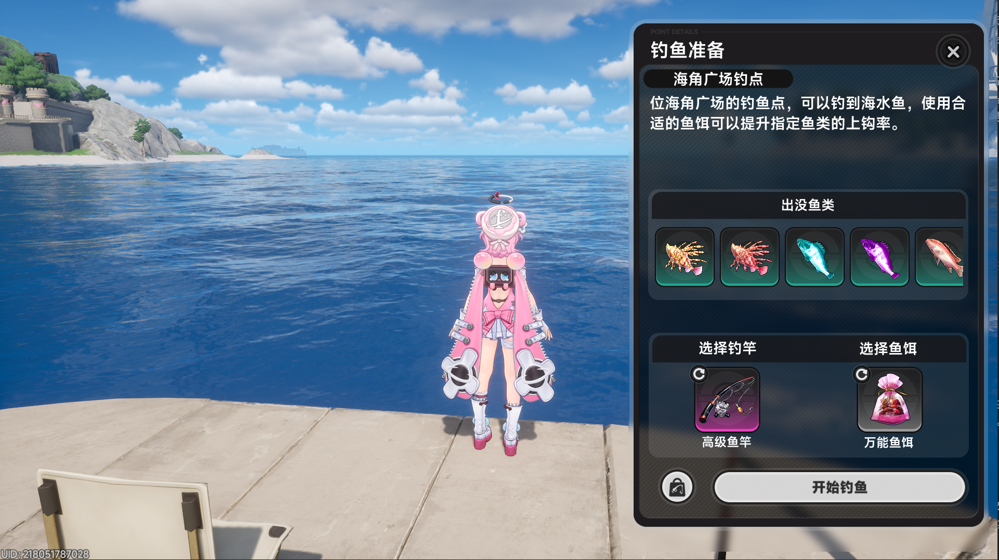

# YiHuan AutoFish

异环自动钓鱼辅助脚本。

## 运行方法：

进入任意一个钓鱼点，进入如图所示的页面

而后按下F10等待模型加载，之后程序会自主运行，自主补充鱼饵。
按下F12终止运行。

## GPT大人的文件说明

- `autofish.py`：主程序入口，负责窗口查找、键鼠操作、自动钓鱼流程、钓鱼条控制和多线程调度。
- `config.py`：静态配置文件，集中保存 OCR 区域、目标文本、坐标、按键、时间参数和颜色阈值。
- `ocr_utils.py`：OCR 辅助模块，负责截图预处理、文本规范化、关键提示识别和指定区域 OCR 读取。
- `get_scaled_mouse_pos.py`：坐标采集辅助工具，用于把当前鼠标位置换算成 1920x1080 参考坐标，并保存采集记录。
- `get_scaled_mouse_pos.bat`：启动坐标采集工具的批处理脚本。
- `Admin_run.cmd`：以管理员权限准备虚拟环境并运行主程序。
- `make_python_exe.bat`：安装依赖并使用 PyInstaller 打包可执行文件。
- `FishAutoPython.spec`：PyInstaller 规格文件，记录当前可执行文件的打包配置。
- `requirements.txt`：Python 依赖列表。
- `image.png`：界面参考图。
- `captures/`：坐标采集输出目录，内容为本地运行产生的 CSV 文件。
- `logs/`：运行日志输出目录。
- `previous/`：历史脚本或旧版本辅助文件。
