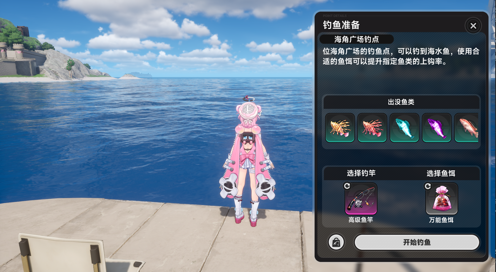

# YiHuan AutoFish

异环自动钓鱼辅助脚本。

## 运行

<<<<<<< HEAD
打包后的版本直接运行：
=======
进入任意一个钓鱼点，进入如图所示的页面

而后按下F10等待模型加载，之后程序会自主运行，自主补充鱼饵。
按下F12终止运行。
>>>>>>> e114e3e7a4fa9ba9312e4195c881038abdb18c0f

```text
dist/FishAutoPython/FishAutoPython.exe
```

进入钓鱼点后按 `F10` 开始，按 `F12` 停止。

<<<<<<< HEAD
程序需要管理员权限，打包出的 exe 已带管理员权限 manifest。

## 分发

把整个目录压缩后发给别人，不要只发单独 exe：

```text
dist/FishAutoPython/
  FishAutoPython.exe
  _internal/
```

EasyOCR 模型已经随包放在：

```text
dist/FishAutoPython/_internal/models/easyocr/
  craft_mlt_25k.pth
  zh_sim_g2.pth
```

对方不需要安装 Python、`.venv`、PyTorch 或 EasyOCR，也不需要手动下载模型。

## OCR 自检

可以用下面的命令确认 exe 能加载 CPU 版 Torch 和随包模型：

```bat
dist\FishAutoPython\FishAutoPython.exe --ocr-self-test
```

自检结果会写入 `logs/autofish.log`。看到类似下面的内容就说明 OCR 环境正常：

```text
torch=2.11.0+cpu cuda_available=False
easyocr_reader_device=cpu
```

## 重新打包

本机已经有模型时，直接运行：

```bat
make_python_exe.bat
```

打包脚本会优先使用项目内的模型：

```text
models/easyocr/
  craft_mlt_25k.pth
  zh_sim_g2.pth
```

如果项目内没有模型，但当前用户目录存在 EasyOCR 缓存，脚本会自动从这里复制：

```text
C:\Users\用户名\.EasyOCR\model\
```

## 文件说明

- `autofish.py`: 主程序入口，负责窗口控制、OCR 线程、自动钓鱼流程和钓鱼条控制。
- `config.py`: 静态配置，包含 OCR 文本、区域、时间参数、坐标、按键和颜色阈值。
- `ocr_utils.py`: OCR 预处理、文本规范化、关键词识别和区域读取。
- `FishAutoPython.spec`: PyInstaller 打包配置，包含 CPU Torch、EasyOCR 模型和 VC runtime 处理。
- `requirements.txt`: CPU 版依赖列表。
- `make_python_exe.bat`: 一键安装依赖并生成 onedir 发布目录。
=======
- `autofish.py`：主程序入口，负责窗口查找、键鼠操作、自动钓鱼流程、钓鱼条控制和多线程调度。
- `config.py`：静态配置文件，集中保存 OCR 区域、目标文本、坐标、按键、时间参数和颜色阈值。
- `ocr_utils.py`：OCR 辅助模块，负责截图预处理、文本规范化、关键提示识别和指定区域 OCR 读取。
- `get_scaled_mouse_pos.py`：坐标采集辅助工具，用于把当前鼠标位置换算成 1920x1080 参考坐标，并保存采集记录。
- `get_scaled_mouse_pos.bat`：启动坐标采集工具的批处理脚本。
- `Admin_run.cmd`：以管理员权限准备虚拟环境并运行主程序。
- `make_python_exe.bat`：安装依赖并使用 PyInstaller 打包可执行文件。
- `FishAutoPython.spec`：PyInstaller 规格文件，记录当前可执行文件的打包配置。
- `captures/`：坐标采集输出目录，内容为本地运行产生的 CSV 文件。
- `logs/`：运行日志输出目录。
>>>>>>> e114e3e7a4fa9ba9312e4195c881038abdb18c0f
